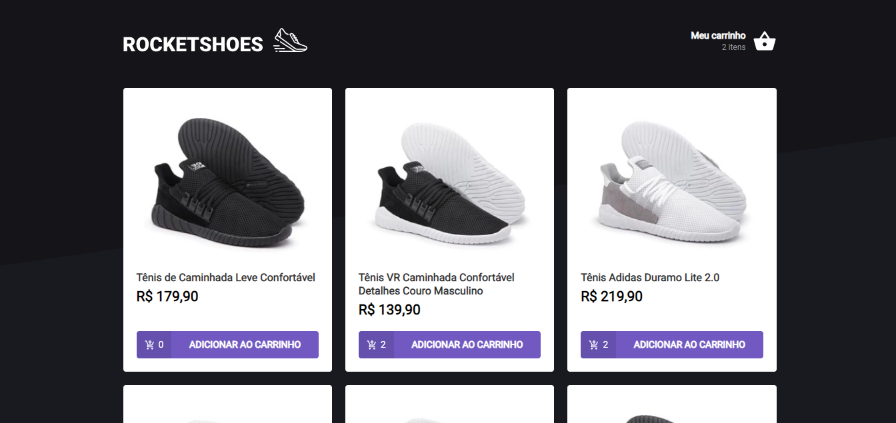

<h3 align="center">
  Challenge 03 - Creating a shopping cart hook
</h3>

<p align="center">
  <a href="https://rocketseat.com.br">
    
  </a>
  
  <a href="https://github.com/luisspassos">
    
  </a>
</p>

<br>

## :rocket: About the challenge

<p align="center">
  
</p>

In this challenge the main objective is to create a shopping cart hook. The application has two pages, one component and one hook to implement the features requested in this challenge:

- Add a new product to cart;
- Remove a product from cart;
- Change the quantity of a product in the cart;
- Calculation of subtotal and total cart prices;
- Inventory validation;
- Error message display;
- Among others.

<br>

## :wrench: Installation and use

```bash
# Open a terminal and copy this repository with the command
git clone https://github.com/luisspassos/rocketshoes
# or use the download option.

# Enter the folder with
cd rocketshoes

# Install the dependencies
yarn install

# Start the fake API
yarn server

# Run the development server
yarn start
```

<br>

## :memo: License

This project is under the MIT license. See the [LICENSE](/LICENSE) file for more details.

---

Made with :purple_heart: by [Luís Passos](https://github.com/luisspassos)

[](mailto:luis.passos013@gmail.com)
